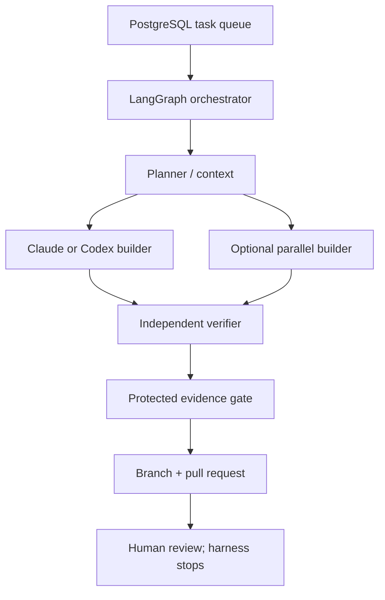

# Claude Code and Codex development harness

## Purpose

The harness turns approved requirements into reviewable branches and pull requests while preserving human authority and deterministic verification. It supports Claude Code and Codex from v0.1 through a common adapter contract. It does not grant either model release authority.

## Execution topology

PostgreSQL is the authoritative task, lease, approval and evidence state. LangGraph checkpoints workflow state in PostgreSQL. Redis may wake workers or coordinate short-lived locks but loss of Redis cannot lose, duplicate-authorize or complete a task.

## Roles and separation of duties

| Role | Allowed | Forbidden |
| --- | --- | --- |
| Human requester | Select requirement/version, add constraints, answer checkpoints | Cannot bypass non-waivable gates. |
| Planner | Read requirements/source/index; produce bounded task and affected-test list | Source edits, test edits, waiver approval. |
| Builder | Edit implementation on assigned branch; run tests; commit/push; draft PR text | Merge, production deploy, protected files, waivers, release evidence signing. |
| Verifier | Read candidate; run protected suites; emit measurements/findings | Fix implementation, weaken thresholds, approve its own exceptions. |
| Security verifier | Run auth/tenant/fuzz/secret/network tests in isolated environment | Receive production secrets or modify candidate. |
| Evidence assembler | Validate provenance and completeness; attach status to PR | Interpret an LLM statement as proof. |
| Human release authority | Review PR and allowed waivers outside harness | Delegate merge/production authority to agents. |

Builder and verifier must use separate workflow nodes and credentials. Prefer different model/provider assignments for high-risk changes, but independence is enforced by permissions and immutable inputs—not assumed from model diversity.

## Common agent adapter

Both provider adapters accept:

- Task ID, requirement IDs and immutable requirement/test digests.
- Repository URL, base commit and assigned branch.
- Allowed paths, tools, network destinations, time/token/cost budget.
- Read-only Graphify index identifier tied to the base/candidate commit when available.
- Expected structured result schema.

They return normalized JSON:

- Status: completed, blocked, needs-human or failed.
- Changed paths and commits.
- Commands run with exit codes and artifact hashes.
- Requirement-by-requirement claim list (informational only).
- Discovered risks, unresolved questions and requested approvals.
- Token/cost/timing metadata without prompts or source/customer content.

Claude Code may run in non-interactive print/SDK mode; Codex may run through `codex exec`/SDK. Headless user sessions are allowed on trusted developer machines for private work. Private CI must use provider-supported automation credentials or approved enterprise access tokens. No adapter credential is exposed inside the repository or build output.

## Workflow

1. **Ingest** — validate task signature, requirement IDs, base commit and authority.
2. **Context** — use registry, source search and optional commit-pinned Graphify to find affected packages; inferred edges are resolved to source.
3. **Plan interrupt** — for high-risk or scope-ambiguous work, persist plan and wait for human approval.
4. **Branch lease** — create/reuse an idempotent branch operation; record base commit.
5. **Build** — one or more isolated builders edit only allowed paths.
6. **Local verification** — run fast tests; these inform the builder but do not create release evidence.
7. **Independent verification** — protected runner checks candidate in a clean environment.
8. **Fan-in** — combine machine evidence and human-required findings; any missing/failed evidence blocks.
9. **PR** — create/update exactly one pull request via stable operation ID.
10. **Stop** — hand control to humans. Never merge or deploy production.

## Idempotency and resumption

Every external side effect has `(task_id, operation_type, target)` uniqueness. A resumed/replayed node first reads the operation record and verifies remote state. It may continue, reconcile or fail; it may not blindly repeat a branch, comment, export, invite, PR or credential operation.

Checkpoints record structured references and hashes, not raw secrets, full prompts or entire repositories. Interrupts are durable for days. Leases expire and are reacquired safely. Cancellation revokes tokens and stops workers without marking evidence passed.

## Protected paths and repositories

The recommended authority boundary is a separate public `platform-conformance` repository/package with signed releases. Core/product repositories pin its OCI/package digest. Builder tokens have no write permission there.

After the initial G0 permission/network baseline is approved by humans, implementation CI rejects candidate diffs touching:

- `requirements/**`
- protected conformance test source/goldens/thresholds
- waiver files or CODEOWNERS/rulesets
- release signing workflows
- established agent permission/network policy

Changing these requires a separate specification PR authored/reviewed by humans and planner/verifier maintainers before implementation begins. The G0 bootstrap PR may propose the initial policy files, but agents cannot apply repository rulesets or approve their own policy baseline.

## Network and secret policy

Default-deny egress with separate policies by node:

- Builder: assigned GitHub repository, selected model, pinned package/container registries and required internal Tailscale endpoints.
- Verifier: candidate checkout, protected test image/dependencies and evidence store; no general browsing.
- Researcher: approved internet access, no repository write token and no secrets.
- Evidence assembler: CI metadata/evidence store only; no model required.

Package network access is normally through a cache/proxy and a committed lockfile. A dependency-change task uses an explicit temporary allowlist and produces an SBOM/license/security diff. Agents never receive production databases, OAuth secrets, infrastructure admin tokens or customer data.

## Graphify policy

Graphify is code-only/local by default. The index records repository and commit SHA, extractor version and content hash. A stale index is ignored. Registry lookup and direct source verification are mandatory before creating a component or claiming impact. Graphify output is context, not evidence; an `INFERRED` edge alone cannot authorize a change or satisfy a requirement.

## Harness acceptance tests

- Kill orchestrator, worker and host at every graph node; resume produces one branch/PR and equivalent evidence.
- Interrupt for human approval, wait beyond process lifetime, reject/approve and verify correct continuation.
- Run two builders in parallel; fan-in includes both results and detects conflicting edits.
- Attempt protected-file edits, merge, production deployment, network escape and secret reads; all are denied and audited.
- Forge/modify evidence, candidate SHA or conformance digest; gate rejects it.
- Remove Redis mid-task; authoritative queue/checkpoint and approvals survive.
- Run equivalent bounded tasks through Claude and Codex adapters; normalized envelopes validate.
