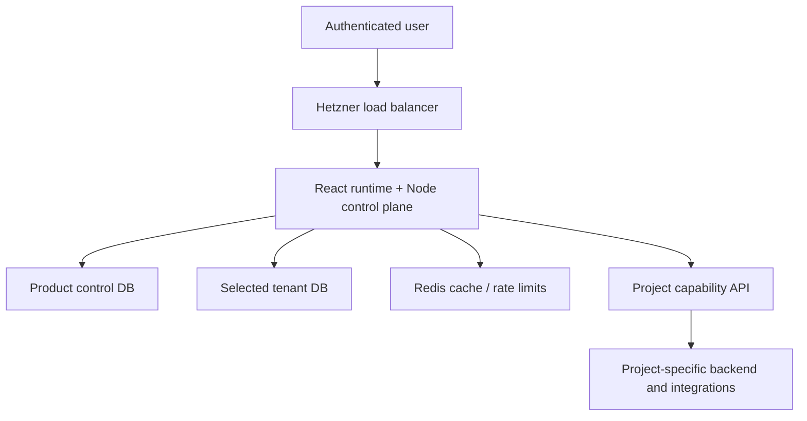
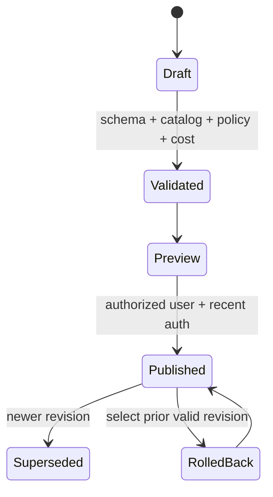
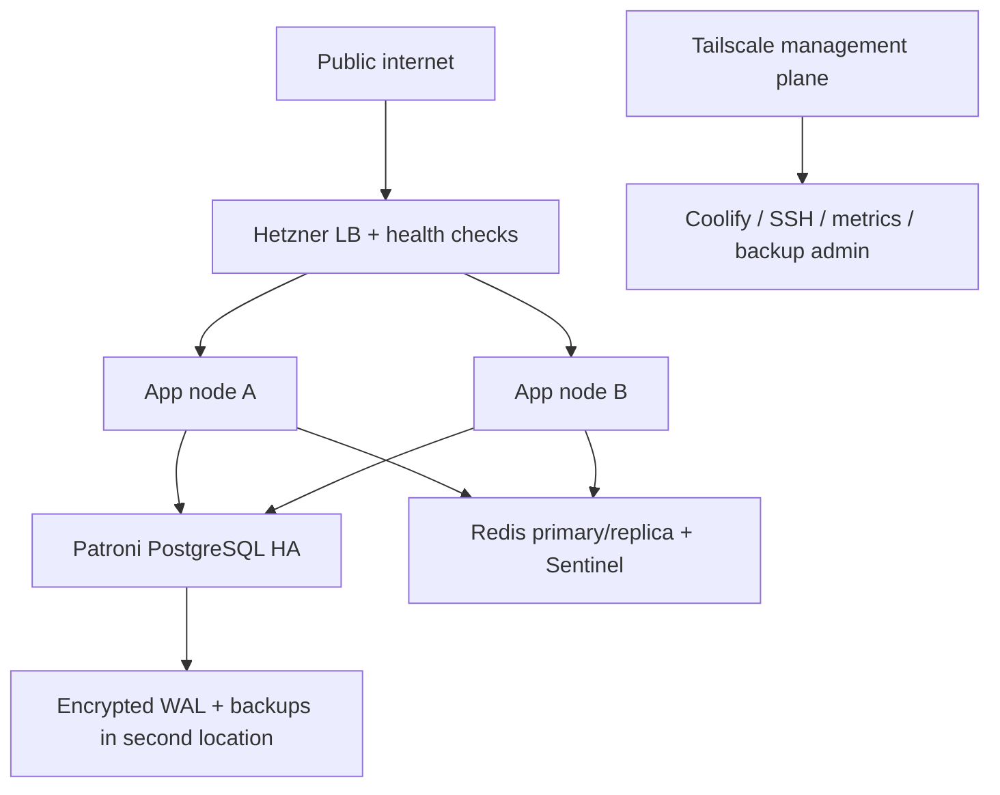
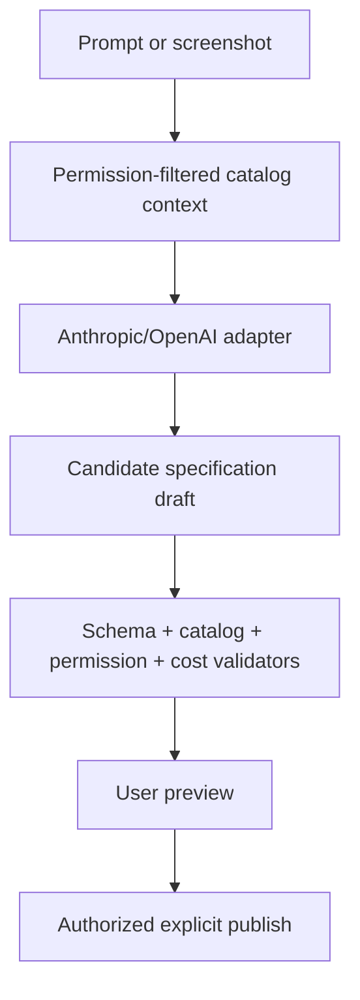

# Canonical architecture

## Architecture style

This is a **declarative application shell plus capability-based backend adapter**, delivered as an open-source internal developer platform. It combines ideas from schema-driven UI, headless application platforms, dashboard builders, backend-for-frontend gateways and policy-enforced AI authoring. It is not a no-code business-logic engine and not a shared multi-product monolith.

Each SaaS product is independently deployed, versioned and operated. Products reuse source packages and contracts—not a global runtime database or a shared production control plane.

The diagram is logical. Production runs at least two stateless application replicas. PostgreSQL, Redis and backups have independent HA topologies.

## Package architecture

The public monorepo should publish independently versioned packages:

| Package | Responsibility |
| --- | --- |
| `@platform/tokens` | Color, typography, spacing, elevation, motion, density and semantic tokens. |
| `@platform/primitives` | Owned shadcn/Radix-derived primitives and accessibility behavior. |
| `@platform/components` | Approved business UI blocks: KPIs, tables, filters, charts, forms, navigation and settings. |
| `@platform/catalog` | Component registrations, property schemas, slots, data needs, permissions and cost metadata. |
| `@platform/spec` | JSON Schemas and TypeScript types for app/page/dashboard/query/action/theme specifications. |
| `@platform/runtime` | Catalog-only renderer, routing, state, error boundaries and policy enforcement. |
| `@platform/composer` | Manual draft/preview/layout editing and revision comparison. |
| `@platform/charts` | Restricted chart grammar compiled to approved rendering primitives. |
| `@platform/i18n` | Message keys and locale-aware formatting helpers. |
| `@platform/capability-sdk` | Language-neutral protocol definitions plus generated clients/server helpers. |
| `@platform/auth` | Better Auth configuration, OAuth policy and authorization primitives. |
| `@platform/control-plane` | Reference Node service for memberships, specs, audit, routing, exports and mediation. |
| `@platform/conformance` | Protected black-box and package-level verification runner. |
| `@platform/agent-harness` | LangGraph workflow plus Claude Code/Codex adapters. |

Products pin exact compatible versions. Platform publication cannot silently update a deployed product. SemVer, signed provenance, changelogs, migrations and an N/N-1 schema compatibility matrix are release artifacts.

The shadcn registry is a code-distribution mechanism, not the runtime catalog. Registry items and transitive registry dependencies are pinned to an immutable tag or commit, reviewed and installed at development time. Runtime specifications reference only the separately generated product catalog.

## Runtime and specification model

Specifications are untrusted data. They contain stable catalog component IDs, validated properties, slots, layout, localization keys, authorized query references and declared action references. They never contain executable JavaScript, raw HTML, arbitrary CSS, raw SQL, URLs chosen by users, template evaluation, model prompts or credentials.

All revisions are immutable. Personal and tenant-shared publication scopes are separate. A user may publish only their personal scope; a tenant admin may publish shared scope. Rollback creates an auditable publication event and never edits historical rows.

## Control plane and tenant routing

Every SaaS product deploys its own TypeScript/Node control plane and control PostgreSQL database. The control database contains:

- OAuth identities and verified provider linkage.
- Tenant directory, invitation and membership records.
- Fixed platform roles and product permission mappings.
- Tenant database routing metadata and migration state.
- Operational policy, residency and retention configuration.
- No domain records and no tenant dashboard specifications.

Each tenant database contains that tenant’s product records, UI specifications, query definitions, theme override, audit partitions associated with tenant activity and action/job state. If a user changes active tenant, the server resolves membership first and obtains the corresponding database route; client-provided database names, tenant IDs or connection strings are never trusted.

Baseline isolation:

- Separate logical database, owner and application role per tenant.
- Unique credentials with rotation and just-in-time retrieval through a `SecretProvider` interface.
- Connection pools keyed by immutable server-resolved tenant identity; connections are fully reset before reuse and never cross database/role boundaries.
- Bounded cluster placement with noisy-neighbor and blast-radius caps.
- Optional dedicated HA cluster using the same protocol and tests.
- RLS inside a tenant database when user, department or resource scoping needs defense in depth.

## Language-neutral capability API

Project-specific backends expose an adapter over HTTPS. The control plane never introspects arbitrary database schemas and the browser never talks directly to a domain database.

Required endpoints/concepts:

1. `GET /capabilities` returns a signed/versioned manifest of resources, fields, metrics, filters, declared relationships, queries, exports and future actions.
2. `POST /query` accepts a restricted query AST: resource, dimensions, measures, declared relationship paths, filters, grouping, sorting and cursor pagination.
3. `POST /export` requests a bounded, authorized export using the same query AST.
4. `POST /actions/{id}/preview` returns effects and validation without mutation.
5. `POST /actions/{id}/execute` eventually executes an idempotent, authorized record mutation. It remains disabled until the read-only gate passes.
6. `GET /jobs/{id}` returns asynchronous export/action state scoped to the same principal.

The control plane passes a short-lived signed principal token containing immutable user, tenant, role, permission, session and request identifiers. Project backends verify issuer, audience, expiry and signature using JWKS and re-evaluate capability authorization. They never trust a tenant identifier in request JSON.

The manifest is a maximum surface set by developers. Tenant administrators may only mask resources/fields/operations. The query compiler rejects raw SQL, undeclared joins, unknown fields, unauthorized aggregates, excessive result estimates and invalid cursor state before the adapter executes anything.

## Action protocol

Actions are declared now but execution is gated. Every action declares:

- Stable ID, input/output JSON Schema and required permissions.
- Allowed record/resource scope; only records inside the application are supported.
- Risk: normal, destructive, bulk or high-impact.
- Preview behavior and a human-readable effect summary.
- Idempotency-key rules, optimistic-concurrency token and maximum batch size.
- Synchronous/async mode, timeout and retry classification.
- Audit fields and redaction policy.

Normal updates require preview and confirmation. Delete, bulk and high-impact actions require recent OAuth reauthentication. The model can select a declared action for a draft, but can never call preview or execute itself.

## Infrastructure topology

- Terraform or equivalent declaratively provisions Hetzner networking, firewalls, load balancers, servers, storage and DNS. Coolify deploys applications; it is not the source of HA truth.
- Applications and services ship Docker images and Compose definitions. Production images are immutable, non-root, health-checked and signed.
- PostgreSQL uses synchronous local replication and an external HA controller such as Patroni. PgBouncer or an equivalent pooler enforces per-database/user limits.
- WAL archiving and database-aware backups target encrypted S3-compatible object storage in the selected recovery location. Hetzner host snapshots are not sufficient.
- Redis provides cache, distributed rate-limit coordination and ephemeral notifications. It is never authoritative for sessions, jobs, specifications, audit or permissions. Loss causes bounded degraded behavior, not authorization bypass.
- Tailscale protects SSH, Coolify, database administration, metrics, backup control and private CI. Public OAuth callbacks and application traffic remain on the public ingress.

## Observability

OpenTelemetry-compatible application signals are collected locally and exported only to explicitly enabled destinations. The reference profile uses self-hosted Prometheus, Grafana, Loki and Alertmanager (or equivalent open components). Logs and traces use IDs, classifications and measurements—not prompts, access tokens, connection strings, screenshots or raw customer values.

Alerting covers availability, latency, error rate, replication lag, WAL archive freshness, restore age, pool exhaustion, Redis failover, rate-limit fallback, authorization denial anomalies, tenant-routing violations, audit pipeline health and agent policy violations.

## AI authoring at G5

Only capability metadata, the user’s prompt and user-supplied screenshots are sent by default. Live record values are excluded. Invalid, unauthorized or over-budget output is rejected; no “best effort” rendering occurs. Production requires supported service credentials and contractual data handling. Headless Claude Code/Codex account sessions are limited to trusted development and prototypes.

## Graph knowledge

Graphify belongs only in the development harness. Its code-only local graph is a derived index tied to a commit SHA. It accelerates component discovery, dependency tracing and duplicate detection. Source, schemas, registry entries, ADRs and tests remain authoritative. Inferred edges must be resolved to source locations before they influence a plan or review. The runtime needs structured catalogs and capability manifests, not GraphRAG.
