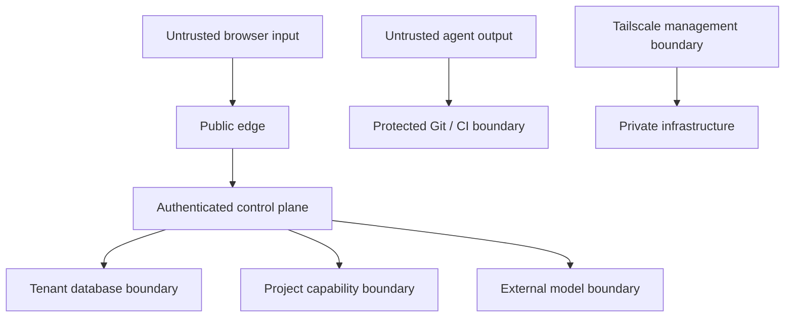

# Security threat model

## Security objectives

1. A principal can access only the products, tenants, records, fields, queries, exports, specifications and actions authorized for that exact request.
2. No UI specification, prompt, screenshot, component property or project response can introduce executable code or bypass catalog/capability policy.
3. Compromise of Redis, a tenant specification, one tenant credential or one agent task cannot become cross-tenant or production compromise.
4. Acknowledged PostgreSQL writes survive certified local primary failure; backups and restore evidence are independent of the failed host.
5. Every privileged operation is attributable, tamper-evident, retained and reviewable without logging secrets or raw customer data.
6. No release claim can be created or weakened by the implementation agent it evaluates.

## Assets and classification

| Asset | Classification | Notes |
| --- | --- | --- |
| OAuth tokens, session secrets, DB credentials, signing keys | Secret | Never in prompts, logs, screenshots, traces, artifacts or agent workspaces. |
| ERP/domain records and user-supplied screenshots | Restricted customer data | Tenant-isolated; screenshots may contain data even when live records are excluded. |
| Exports and action previews | Restricted customer data | Short retention, encrypted, audited, single-tenant authorization. |
| Capability manifest and UI specifications | Confidential metadata | May expose business structure; tenant-scoped and validated as untrusted input. |
| Audit/evidence records | Integrity critical | Append-only behavior, hash/provenance protection and separate authorization. |
| Source, schemas, component registry | Internal/public by repository policy | Public core contains no secrets or customer configuration. |

## Actors

- Anonymous internet attacker.
- Authenticated user with one or more legitimate tenant memberships.
- Malicious or compromised tenant administrator.
- Compromised OAuth account or provider session.
- Project backend returning malicious or malformed data.
- Prompt/screenshot containing injection or exfiltration instructions.
- Compromised dependency, container, CI runner or agent tool.
- Builder agent attempting to weaken tests or expand its authority.
- Operator with management-plane access.

## Trust boundaries

Inputs are revalidated at every boundary. Tailscale connectivity is not authorization; services still require identity, least privilege and TLS.

## Primary threats and mandatory controls

| Threat | Required prevention/detection | Deterministic proof |
| --- | --- | --- |
| Tenant IDOR / confused deputy | Server-derived active membership; tenant not selected from body/header; per-tenant DB role; backend reauthorization | Cross-product property tests mutate every tenant/user/resource combination and inspect query logs. |
| Connection-pool bleed | Pools keyed by immutable route and DB role; reset/discard state; no search-path tenant switching | Poisoned-session integration test followed by another tenant request. |
| Compromised control DB | No customer records/specs; DB routes encrypted; control role cannot read tenant databases directly without brokered credential | Privilege enumeration and denied cross-database connection tests. |
| OAuth account takeover/linking | Provider issuer+subject identity; verified email; invitation binding; no automatic cross-provider link by email alone; domain/Entra policy | Forged/unverified email, issuer collision, stale invite and provider-confusion tests. |
| Session theft/fixation | Secure HttpOnly cookies, SameSite policy, CSRF protection, rotation, bounded lifetime, revocation and recent-auth timestamp | Browser-level fixation, CSRF, replay and logout/revocation tests. |
| Malicious UI spec | JSON Schema, catalog allowlist, depth/size/cost limits; no code/HTML/CSS/URL evaluation | Schema fuzzing, prototype-pollution payloads and catalog escape corpus. |
| XSS from project data | Context-safe rendering, no raw HTML, Trusted Types/CSP where supported, URL protocol allowlist | Browser XSS corpus and CSP violation assertion. |
| Raw SQL/inferred join | Restricted AST; declared relationships; parameterized adapter; allowlisted fields/aggregates | Grammar/property fuzzing and SQL metacharacter corpus; adapter query audit. |
| Expensive query/DoS | Static cost model, page/result/time limits, cancellation, tenant/user quotas, concurrency caps | Boundary and load tests prove rejection before backend cost threshold. |
| Export exfiltration | Same query authorization, row/byte/time limits, recent auth, short-lived single-use download, audit | Permission matrix, expiry/replay and oversize tests. |
| Spreadsheet injection | Prefix/escape cells beginning with formula control characters; preserve typed numeric/date data | CSV/XLSX malicious-cell test opens/parses generated file and asserts inert content. |
| Action replay/race | Idempotency key, optimistic version, preview hash, expiry, risk-based recent auth | Duplicate/concurrent execution tests prove one committed effect. |
| Prompt injection | Model sees non-secret metadata; no model DB/action tools; output is data-only draft; deterministic validators | Adversarial prompt/screenshot corpus; zero unauthorized catalog/capability reference. |
| Screenshot data leakage | Explicit upload classification/notice, encryption, bounded retention, deletion, no logs/traces | Lifecycle test verifies object deletion and telemetry absence. |
| Redis outage bypass | Redis not authoritative; sensitive endpoint limiter fails closed or uses conservative local fallback; cache keys tenant-prefixed | Redis kill test proves no authorization change or unlimited privileged requests. |
| Agent evidence forgery | Protected conformance runner, separate credentials, signed evidence tied to commit/test digest | Attempted edits and fabricated evidence fail CI and provenance verification. |
| Supply-chain compromise | Lockfiles, registry allowlist/proxy, dependency review, SBOM, provenance, signed images, secret scan | Reproducible build, SBOM diff, signature verification and malicious-package fixture. |
| Management-plane exposure | Coolify/SSH/DB/metrics/backups private over Tailscale plus service auth; firewall default deny | External port scan and ACL/identity negative tests. |
| Backup compromise/failure | Encryption, separate credentials/location, append/retention controls, restore drills | Scheduled isolated restore with checksums and tenant sampling. |

## Identity and authorization invariants

- The identity key is `(provider_issuer, provider_subject)`, not email.
- Email must be verified and match the invitation at first acceptance. Linking another provider requires an already authenticated session plus recent reauthentication; matching email alone is insufficient.
- Microsoft organizational restriction validates Entra tenant ID; display domain alone is insufficient. Google restriction uses verified hosted-domain/account claims and explicit policy.
- All authorization is deny-by-default. A role maps to a product-declared permission catalog. A tenant admin can assign a platform role but cannot mint new permissions.
- Active tenant change is a server operation that verifies membership, rotates tenant context and invalidates tenant-scoped cache. A request cannot name another tenant to override it.
- Publishing, exports and mutations require a recent-auth timestamp. Destructive/bulk/high-impact actions additionally require a preview bound to the exact input, record versions and user.
- Better Auth organization self-creation and dynamic role creation are explicitly disabled in the reference profile. Its default account-linking behavior is not accepted unchanged: automatic linking is disabled or restricted so an authenticated, recently reauthenticated user must initiate the approved provider-link flow.

## Database and secret controls

- PostgreSQL administrative, control-plane, migration, backup and tenant runtime roles are distinct. Applications never use superuser or database-owner credentials.
- Every tenant database has unique runtime/migration roles. Runtime roles cannot create extensions, roles or databases and cannot access other logical databases.
- Credentials are referenced by opaque secret IDs in the control DB and retrieved just in time through a pluggable secret provider. Bootstrap secrets are encrypted outside Git; rotation and revocation are tested.
- TLS is required for service/database/cache connections. Backup objects are encrypted before or at storage with independently controlled credentials.
- Sensitive field-level encryption is applied where the product data-classification manifest demands it. Database-per-tenant is not treated as encryption.

## Web and API baseline

The reference implementation targets OWASP ASVS Level 2 controls appropriate to its features. At minimum it enforces input/output schemas, body/header/time limits, secure cookies, CSRF defense, restrictive CORS, CSP, safe redirects, SSRF-resistant URL handling, MIME validation, file-name isolation, request IDs, generic errors, dependency/container scanning and rate limits by IP, account, tenant and capability.

The Tailscale policy file must be explicit and tested. The reference profile uses grants/ACLs with deny-by-default behavior and must not rely on the product's permissive default policy when no access-control section is configured.

## Audit

Events include authentication, invitation, membership/role changes, active-tenant changes, specification draft/validate/publish/rollback, capability-policy changes, queries above risk thresholds, exports/downloads, actions, recent-auth challenges, secret rotation, migrations, restore/failover drills and agent/waiver decisions.

Events record actor, tenant, product, action, target ID, outcome, request/session ID, policy version, timestamp and redacted metadata. They never record tokens, credentials, raw prompts/screenshots, query results or record values. Retention defaults to one year and is configurable from 90 days to seven years. Deletion is policy-driven and evidenced.

## Non-waivable controls

No waiver may permit cross-tenant access, arbitrary runtime code, raw SQL, model execution of queries/actions, production credentials in agent contexts, builder modification of protected tests, unverified evidence, disabled audit for privileged operations, or plaintext secrets/customer exports.

## Security release practice

- Threat model and data-flow review for every new trust boundary.
- SAST, dependency, secret, IaC and container scans on every PR.
- DAST, authorization matrix and fuzzing on release candidates.
- Independent penetration test before v1 external production use and after material auth/tenant/runtime changes.
- Documented incident response, key rotation, provider revocation, tenant notification and evidence preservation drills.
