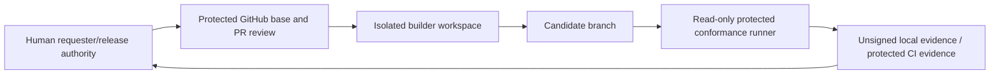

# G0 trust boundaries and data flow

G0 introduces development and verification boundaries only; it does not introduce a customer runtime trust boundary.

## Assets

- Requirement, protected-test, waiver, threshold, and release-policy integrity.
- Repository and model credentials used by isolated agent processes.
- Candidate source and exact commit identity.
- Conformance runner/test-source digest and evidence provenance.

## G0 controls

- Builder credentials are branch/PR-only and cannot write conformance authority.
- Task envelopes contain protected digests and bounded paths/tools/network/time/output.
- Codex runs with explicit workspace-write sandboxing and an ephemeral session; credentials enter only the Codex invocation environment.
- Claude Code is a contract plus deterministic mock until its protected suite authorizes the operational adapter.
- Conformance evidence is not accepted from the candidate repository's own tests.
- PostgreSQL and Redis foundation containers are private to the Compose data network; Redis remains non-authoritative.
- No production, OAuth, infrastructure-admin, customer, or signing credentials are present.

## Residual G0 checkpoints

- Humans must apply GitHub rulesets/CODEOWNERS and approve the proposed agent/network policy.
- Protected verifier CI and evidence signing identities must be provisioned outside builder authority.
- Redis image licensing must receive human legal review before production distribution.
- Tailscale service identities remain intentionally empty until the management topology exists at G6.

New application, identity, tenant, capability, query, action, AI, infrastructure-management, or customer-data boundaries require later-gate threat-model updates before implementation.
